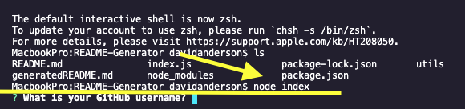

I have created a README generator that takes in all the users info through the command line and creates a new markdown file with all of the users input.

This application is all run through the command line using node, so there is no deployment.

The user will be able to enter all of their info and generate a clear read me for any project. This will enable the user to focus on the actual project and feel confident that the read me is informative and professional looking.

Here's to creating a standard read me with minimum effort!

Start the application in the terminal!

 

- Once you are in the correct directory, rune "node index" in the terminal line to begin the node questionnaire! 

Check out the read me generator in action!

[README GENERATOR VIDEO](https://drive.google.com/file/d/1UyQczvobegbu1TvwTveFDikWrecgdPYo/view?usp=sharing)
